August 17, 2022

<dl>
<dt>Authors</dt>
<dd>Mel Nguyen</dd>
<dd>Liu Jason Tan</dd>
<dd>Chihshen Hsu</dd>
<dt>Source Code</dt>
<dd><a href='https://github.com/data-pandas/mads-cap-social-monitoring'>https://github.com/data-pandas/mads-cap-social-monitoring</a></dd>
<dt>Dashboard</dt>
<dd><a href='https://datastudio.google.com/reporting/c8b5e9f2-4760-4417-a958-e069552b9f69'>https://datastudio.google.com/reporting/c8b5e9f2-4760-4417-a958-e069552b9f69</a></dd>
<dt>Video Walkthrough of Dashboard</dt>
<dd><a href='https://youtu.be/DUZgPvu9iAY'>https://youtu.be/DUZgPvu9iAY</a></dd>
</dl>

# 1. Introduction
Companies spend a lot of money maintaining their brand names on social media platforms, but they often lack the tools to systematically analyze, monitor, as well as predict how their brand images are being perceived by users. Traditional methods used to measure Net Promoter Score (NPS) - a proxy to measure customer sentiments, such as online surveys or focus groups - often come with an inherent time lag, as it takes human time and effort to collect, process, and calculate the score. While these methods continue to be widely used across various industries, fundamentally they are unable to detect fast-changing, or even worse, negative viral events such as a PR crisis, leaving companies struggling to mediate upset customers efficiently. From a business perspective, this could seriously hurt a company’s growth. For example, a viral event on Twitter calling for a ban on Foodpanda in Thailand resulted in a loss of over 2 million users in days (Furtado & Tiu, 2021).

Our project leverages supervised & unsupervised learning to build a machine learning application that predicts customer sentiments/emotions, understand what topics customers are talking about, and possibly detect any large swings in sentiment (e.g. PR crisis). This project is meant to address the issues mentioned above. It allows a quicker and more automated way to manage brand image through social monitoring. The business domain that we will be focusing on is food delivery platforms in the United States. 

The project consists of five main tasks, namely - 1) collecting raw data, 2) curating our own labeled dataset, 3) training and selecting among various classification algorithms for emotion classification, 4) applying unsupervised learning algorithms for topic modeling, and last but not least, 5) creating a pipeline to automate the entire process from data collection to the final dashboard.

# 2. Methodology

## Data Collection And Dataset Development

### Data Collection
We choose to use data scraped from Twitter as a proof of concept since it has a large user base and an open API (snscrape). Our project can be scaled to other platforms and domains given more time and resources. 

This data consists of Tweets from June 1st, 2022 to August 1st, 2022 and includes either one of the following hashtags: 
- #ChowNow
- #Deliverydotcom
- #DoorDash
- #gopuff
- #Grubhub
- #Instacart
- #Postmates
- #Seamless
- #UberEats

We then filtered the Tweets to English only and excluded any retweets or posts from the company itself. Once we scraped the necessary data from Twitter, we started the labeling and cleaning process.

After filtering, our initial dataset has 9282 Tweets from these 9 companies. The image below shows an example of the raw data scraped. 

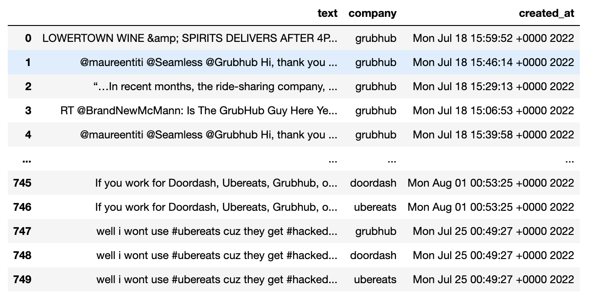

Here you can see that we collected the Tweets from the 9 companies, with the corresponding company and timestamp. 

### Labeling and Cleaning
We choose to label our data manually instead of using a pre-labeled dataset so we can have the flexibility of having multiple labels. For example, a Tweet can be both anger and surprise. Our custom labels allow us to capture such complex emotions, which is essential for our project. In our labeling tool, we have the option of labeling yes or no to each of the following emotions: disgust, joy, anger, surprise, sadness, fear, and neutral. This gives a possibility of 128 possible combinations of unique labels, although, in practice, there are much fewer unique labels (for example we did not find Tweets that were both joyful and sad). Regardless, we choose this method of labeling to have extra flexibility.  With just under 10,000 Tweets in our dataset, labeling row by row would be time-consuming and ineffective. First, we split the task by company. Each team member would label 3 of the 9 companies. Next, we used pysentimento’s pre-trained classifier to add an initial sentiment. 

Finally, inspired by the [MyVoice data challenge](https://midas.umich.edu/myvoice-data-challenge/) that one of our teammates participated in, we decided to build a tool that would cluster the Tweet sentiment using the pre-trained  BERT network. This tool allows us to label our dataset in clusters/batches instead of row by row. The tool works by first splitting the dataset based on pysentimento. Then the tool will use the bert network to split into the initial clusters. For each of the initial clusters, the labeler (one of our team members) will be able to choose whether or not to split. For example, we can split a neutral cluster into 10 sub-clusters and label each of them, and we may choose not to split the surprised initial cluster because it is already aligned with the labels we want. This structure allows us to fine-tune each label where necessary. Note that we are only keeping the labels from this tool and we are not using the initial pysentimento labels after. 

The table below shows the labels created by our team members. 

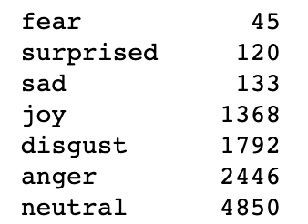

As you can see, there is a severe class imbalance. The neutral class is significantly more prevalent in this dataset, and the fear class is significantly less prevalent. Although we did try to address this class imbalance, there was no performance advantage in doing so. We go more into detail about the class imbalance in the modeling section of this blog. 

Once we had all of our custom labels, we started cleaning the data. The first step is to combine all of the CSV files from each of our teammates into one dataframe. Next, we had to do text preprocessing using the NLTK library, which includes lowercasing, lemmatization, removal of stop words, removal of punctuation, removal of companies, and removal of links. For example, this process would turn “delivered”, “DELIVERY”, “deliveries”, and “delivers” into “deliver”. It would also remove words that appear too often, like “the”, “is” and “it”, as well as words about the company like “DoorDash” and “uber”.  This step allows the text to be consistent and removes unnecessary items, making the dataset smaller for the next steps. The image below shows what our cleaned and labeled dataset looks like.

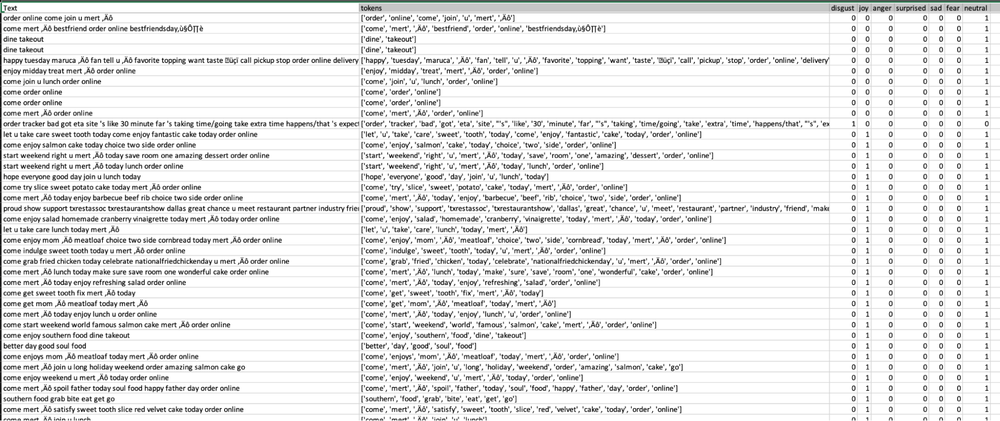

After data cleaning, we began vectorizing the data for the classification model training and tuning. 

## Model Selection And Fine Tuning

### Scikit-learn Classification Model Training
Our classification task is essentially a multi-label classification task, where each document (tweet) may belong to more than one emotional category simultaneously. This is an important distinction from a multi-class classification task, where the classes are mutually exclusive. Fortunately, the sci-kit-learn toolkit supports both multi-class and multi-label tasks seamlessly with any pre-existing classification algorithms. For multi-label classification, the `MultiOutputClassifier` class allows us to simply fit any out-of-the-box classification algorithms to extend the classification to multi-label. This is a major advantage of using sci-kit-learn, as we just need to add one extra step in the training pipeline. There is no change to preprocessing, cross-validation, or hyperparameters tuning between each sklearn model. Furthermore, the MultiOutputClassifier also supports fitting non-sklearn but popular classification algorithms, such as CatboostClassifier or XGBoostClassifier.

We then proceed to fit our curated train dataset into a suite of classification algorithms. For each algorithm, the following two preprocessing approaches were used:
- Bag-of-words (BOW): A BOW is constructed by first tokenizing our documents, then fitted and transformed by using a TF-IDF vectorizer. We then set a max frequency for our vectorizer, remove English stop words, and include unigrams and bigrams in the vectorizer, although it is notable that including n-grams beyond bigrams does not result in any performance improvement.
- Word Embeddings: An alternative to bag-of-words representation is to instead represent documents as word vectors. Our word vectors are constructed using 4 different corpora - our entire text reviews corpus, as well as gensim’s pre-trained corpora, namely `wordvec-google-news-300`, `glove100`, and `glove300`. 

The following table summarizes the best result achieved for each classification algorithm in terms of macro-average F1 score/AUC, using both BOW and word embedding methods. For each classification algorithm, we perform hyperparameter tuning by performing a grid search on both the vectorizer and the estimator’s parameters.

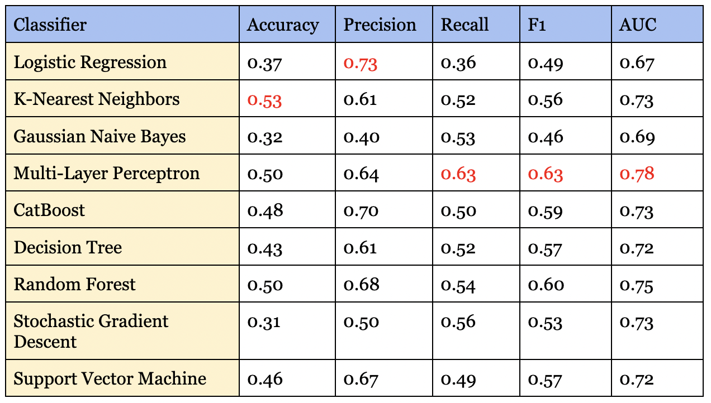

MLP performed the best in terms of both macro F1 and AUC score. We note that for multi-label tasks, the accuracy can appear rather low. This is primarily due to our dataset being highly imbalanced, with certain emotions such as surprise not appearing as often as emotions such as neutral. While some algorithms allow adjusting for class imbalance, we find that sklearn algorithms are not efficient at addressing this issue. 

For most classification algorithms, the bag-of-words approach outperforms the word embeddings approach, though not by a significant margin. The only algorithm where we can see word embeddings performing better otherwise is SGD.  It is interesting to see that gensim’s corpora model performs almost just as well as using our curated dataset. Having text represented as word vectors can also be useful for many other cases, including, but not limited to topic modeling and document similarity. The promising performance on gensim’s out-of-the-box corpus also means that companies who would like to set up NLP models without having access to a lot of training data can potentially leverage this approach.

### Fine Tuning BERT Model
The input of bert consists of three parts: word vectors, segment vectors, and position vectors. Word vectors are each independent word, which is the most basic component of an article, while segment vectors are used to segment sentences. The end of a sentence usually includes `[SEP]`, and the beginning usually includes `[CLS]`. The position vectors indicate the location of a word and are used because the transformer architecture cannot remember the order of word vectors like with RNN-type models (Clark et al., 2019).
To create the appropriate input for bert, we need to convert all the raw text inputs into tokens for the analysis. Once we have the appropriate input, we can begin to fine-tune the architecture of the bert model. To do this, we referenced the contents of hugging face, Sun et al. (2019),  and other code and modified them for our project. We’ve set the epoch to 5 and used ROC AUC as the comparison metric. We tried several different sets of bert pre-train classification models and compared their performance. The following table contains the results of seven models trained on five epochs. The highest AUC scores are shown in the table below.

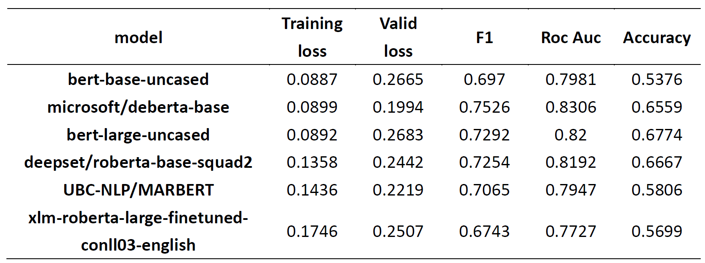

As you can see, we tried a total of 7 sets of models as the basis for our analysis, and we found that the larger models did not perform better in our task. This may be caused by:
- The imbalance in our data classes: we have a large neutrality class (almost half) and a small percentage of data on the remaining emotions, and
- The data volume: there are only ~9000 rows and the larger models may need more data (hundreds of thousands of rows) for training. 
It is important to note that although we initially determined that emotion requires a confidence level above 0.4, this threshold is too high for new Tweets creating some null values. We had to lower the confidence level to 0.2 to make the analysis complete. 

Despite these obstacles, the Microsoft bert model still performed better than all the other models (bert and sklearn), so we ultimately chose this model for the deployment of our dashboard. This classifier will be able to take in a vector and output the emotions related to the Tweet. This is an essential part of making our dashboard effective in showing the current sentiment of newly retrieved Tweets. 

### Topic Modeling 
Starting from the TF-IDF vectorized dataset, we tried several topic modeling algorithms with our dataset, including Latent Dirichlet allocation (LDA), Latent Semantic Indexing (LSI), and Non-negative Matrix Factorization (NMF). We found that NMF produced the most interpretable results (although this may be subjective), so we are choosing it for our dashboard. The image below shows the output of the NMF algorithm on our Twitter dataset

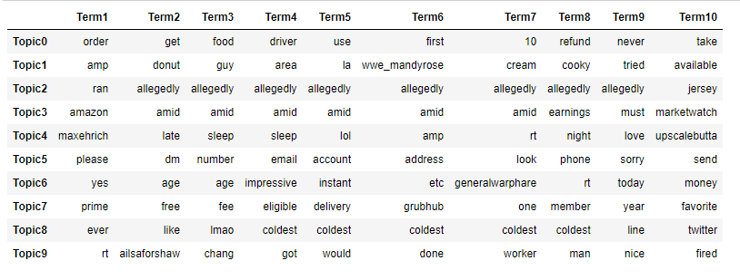

Here we show the top 10 words in each of our 10 topics. We can see that topic 0 is more about ordering, while topic 5 is more about account issues. Some topics might be harder to interpret, like topic 2; it might just be an outlier. Regardless, we believe that this would be informative in showing what is trending. 

When applied to the dashboard, we will be able to show each topic and the corresponding terms for the topic. Additionally, we also show sample Tweets for each topic. This way, the end user (companies) will be able to see what a topic is about and see how closely related it is to the actual Tweets. Our goal with the dashboard is to make it very easy for decision-makers in PR or marketing to see the trends in the Tweets.

## ML Pipeline On Google Cloud Platform (GCP)

### Implementation
Google Cloud Platform (GCP) is a suite of cloud computing services, supporting a wide range of use cases, from cloud computing and data analytics to data storage to machine learning. Given our eventual goal of creating a functional and easily accessible dashboard, we decided to leverage the GCP stack to achieve this objective.

Our pipeline is designed to handle the end-to-end process of monitoring sentiments daily. This means that we would need three main components. Firstly, we need a component that could, on a specified schedule, obtain the latest batch of Tweets from a list of given hashtags, and stream these Tweets into a location that would later be used for predictions. Secondly, we need to host our pre-trained sentiment classifier. With Google Cloud, it is technically possible to also train/retrain ML models directly. This is especially relevant in real-life use cases where the model itself needs to be monitored for any degradation of performance (e.g. concept drift); however, model retraining is outside the scope of this project. We instead opt to train the model locally and deploy the trained model onto GCP to generate predictions using the data obtained from the step above. Thirdly, we need a service to also take in the data obtained from step 1, and perform topic modeling on them. Since unsupervised learning does not require any model training, this process can happen on a specified schedule. Last but not least, we need to store the prediction results (both sentiment classification and topic modeling) in a location that can be plugged into our data visualization platform. 

The diagram below shows an overview architecture of the pipeline end-to-end:

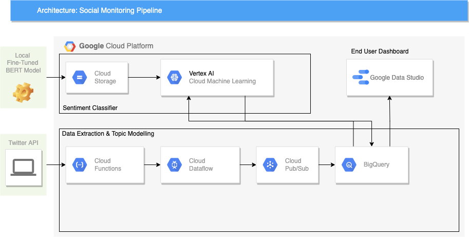

It is important to note that this proposed architecture is not the only way to implement the pipeline end-to-end. GCP is powerful in the sense that it provides a wide breadth of tools that could serve the same use cases in different ways. As we will discuss further in subsequent sections, the choice of tools can greatly impact not only the design but also in terms of efficiency as well as the cost incurred to keep the pipeline running.

In the following sections, we will discuss the implementation of each component in more detail.

#### Data Extraction And Topic Modeling Using Cloud Functions And Cloud Dataflow
The fundamental objective of the data extraction component can be broken down into two sub-tasks. First of all, we need a service that can execute API calls to Twitter at a user-specified schedule. The API calls should then return with JSON Tweet objects, as with Twitter’s standard protocol. We then need a service that can “stream” these messages into storage that could later be consumed to generate predictions.

In the Google Cloud Platform, there are several ways to accomplish either sub-tasks. Our design of choice, as shown in the architecture diagram above, is to use a combination of Google Cloud’s Cloud Functions, Dataflow, and Cloud Pub/Sub. 

Google Cloud Functions allow us to run any function in the cloud, with no servers or container maintenance required. Our function to request Tweets from Twitter is python-based, but Cloud Functions also support Java-based functions. To deploy, we package our tweeps (Twitter’s API library) into a python function that makes calls to the API to retrieve Tweets, based on a list of pre-defined hashtags. However, that will only solve half the equation, which is to get the JSON objects from Twitter. We will also need to, in our function, specify where to send these objects. This is where Cloud Dataflow and Cloud Pub/Sub come in. 

Both Dataflow and Cloud Pub/Sub are services that are used for streaming analytics. In our Cloud Functions, we specify a “topic” that the messages that should be sent. Dataflow is essentially a streaming schema, where users specify how the ingested data should be distributed. In this case, Google Cloud provides a suite of pre-built Dataflow templates, which makes the task of setting up the ingestion and distribution much simpler. 

The last step of the data extraction process is to choose a service to store the Tweets for model serving later on. Our team decided to choose Google BigQuery, which is a cloud data warehouse, for various reasons. First, BigQuery allows us to query the data using SQL, which makes the task of processing raw data easier and can be done directly on GCP. Secondly, Google allows any BigQuery table to connect seamlessly with Google Data Studio to create a dashboard. 

Having decided on using BigQuery as the destination, we can then return to Dataflow, and use one of GCP’s existing templates - 

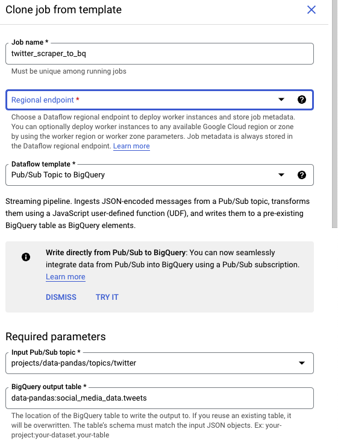

In the template, we specify which topic the streaming should start from (“Twitter”), as well as the destination BigQuery table (“Tweets”).  

Last but not least, to fully automate the flow, the cloud function needs to be configured to run at a specified schedule. On GCP, this can be achieved by using the Cloud Scheduler. Cloud Scheduler allows users to schedule any jobs, cloud functions included. 

To summarize, the data extraction process starts with retrieving Tweets from Twitter API via Cloud Functions (scheduled by Cloud Scheduler) and sending these Tweets through to BigQuery via Cloud Dataflow and Cloud Pub/Sub.

Below is an example of the destination BigQuery table:

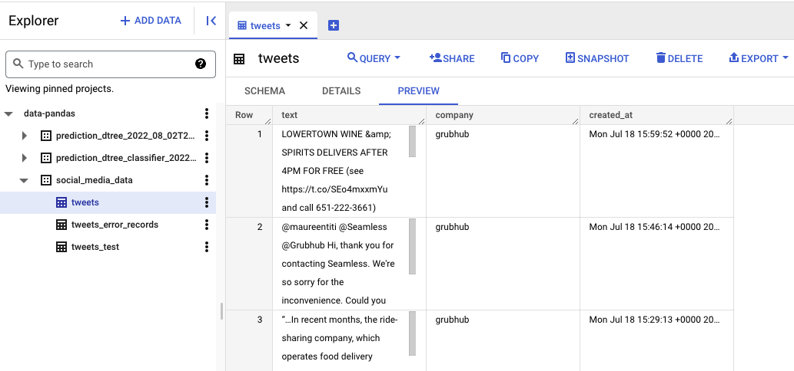

The same workflow can be set up for topic modeling, with the only difference being that our data source is the Tweets table that we have created. Instead of making API calls to Twitter, our topic modeling cloud function queries the text from the Tweets table, applies any topic modeling algorithms (e.g. Non-Negative Matrix Factorization), and sends the topic modeling results back into a BigQuery table, using the same Cloud Pub/Sub and Dataflow workflow. 

#### Model Training And Predictions With Vertex AI
Vertex AI is Google’s flagship AI platform. With Vertex AI, we can easily train ML models using Google’s AutoML. We could also train a custom model with widely-used open-source frameworks such as sci-kit-learn or TensorFlow. Alternatively, Vertex AI also allows users to deploy locally-trained models, as well as supports both real-time and batch prediction requests. 

As our free trial account does not come with any GPU access, our team chose to fine-tune the BERT model locally, while at the same time training a sci-kit-learn classification model on Vertex AI. To train a model, the following steps were done:
- Create a Cloud Storage Bucket. A cloud storage bucket is simply a file repository on GCP. This storage bucket contains our training dataset, which was curated during the data labeling stage. The same storage bucket can also be used to store the trained model file later on.
- Spin up a Jupyter Notebook instance on Vertex AI. This can be done by navigating to the Workbench section and creating a Notebook. At this stage, GCP will request the user to specify whether he or she would like to train an ML model using AutoML, or an open-source framework.
- For the model to be deployable for batch predictions, we need to package our preprocessing and training code into a .py model file. With sci-kit-learn, this can be done by using the `Pipeline` class.
- Once the preprocessing and training code is set up, we can use the Jupyter notebook instance to load the train data from the Cloud Storage Bucket in step 1, and submit a training job to GCP. This triggers Vertex AI to start the model training process. 
- The trained model (.joblib or .pkl) file, once created successfully, will be available at the provided storage bucket path specified. Users can also opt to monitor the process and/or debug errors through the Logging service. 

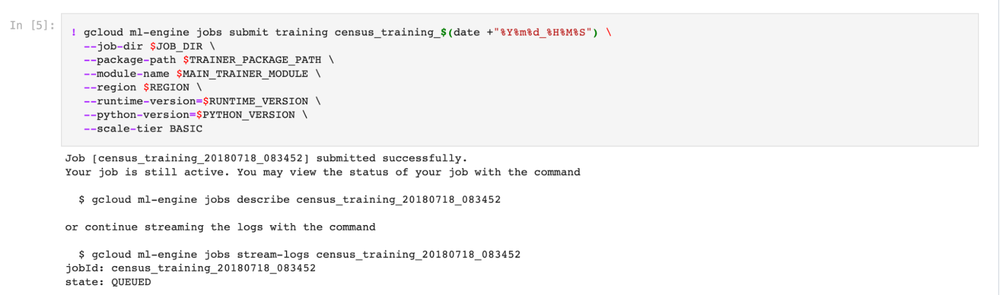

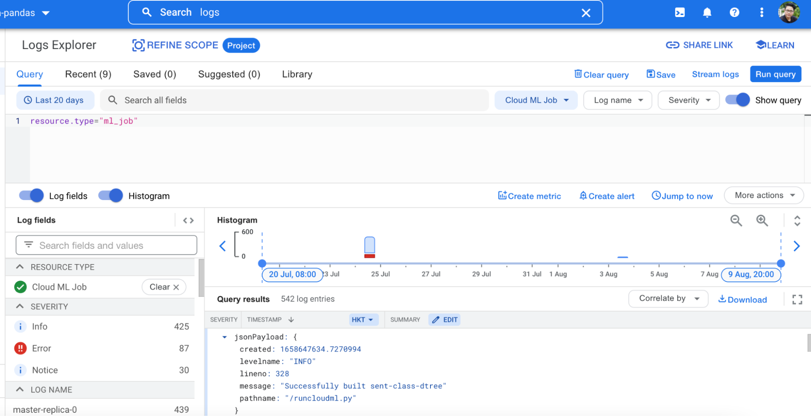

The process to deploy a trained model is straightforward if the model uses any of Google’s supported pre-built container templates. For deep learning, however, only Tensorflow is supported. As a result, our locally trained BERT model, which was Pytorch-based, had to be converted to an ONIX file. From there, the model weights can be saved into Tensorflow’s .pb file, and deployed onto Vertex AI.
The last step is to request a batch prediction. On Vertex AI, this is done by creating a batch prediction request, which takes any of the deployed models, the BigQuery table containing the source data, and outputs a second BigQuery table with the prediction results. 

#### Social Monitoring Dashboard With Google Data Studio
Once both the sentiment classification and topic modeling results are ready, we can develop a dashboard to demonstrate the result. In reality, this would be a dashboard that marketing or public relation teams can refer to at any given time to monitor customer sentiments. The dashboard can be accessed [here](https://datastudio.google.com/reporting/c8b5e9f2-4760-4417-a958-e069552b9f69).

One great advantage of GCP is that it allows users to create a Google Data Studio dashboard from any BigQuery table in a few clicks. All users need to do is to go to the BigQuery table, and choose the option to “Explore with Data Studio”.

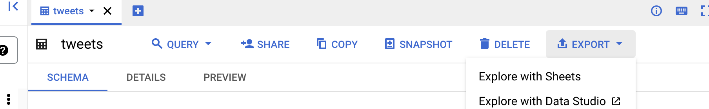

A dashboard is an ultimate endpoint for users for both technical and business audiences to get a view of what the entire social monitoring pipeline may look like. As a technical user, the dashboard allows him/her to drill down into the prediction results, and get a sense of the quality of both the sentiment classifier as well as the topic modeling. On the other hand, a business user can use the dashboard to gain insights right away into, including but not limited to, the volume of tweets daily, the sentiments of these tweets, and the dominant sentiment(s), as well as the top terms in each corresponding topic. The following illustrations show the sentiment analysis and topic modelling views of the dashboard:

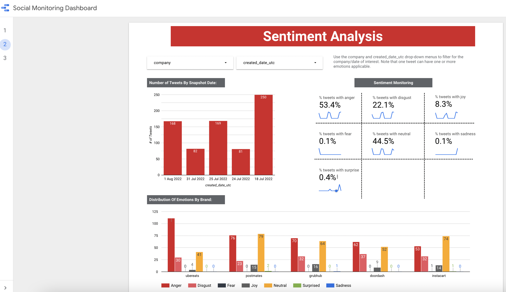

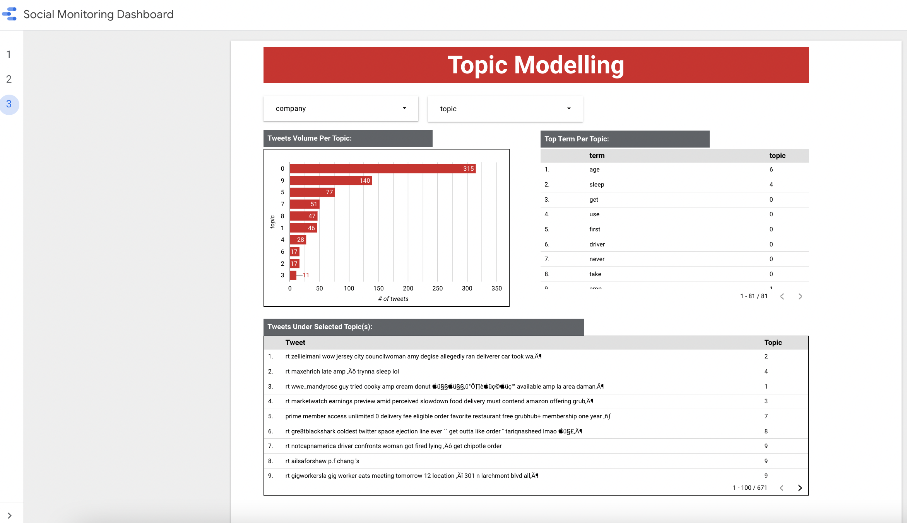

### Challenges & Limitations
Our GCP account is set up on the premise of being a free trial account. We were granted a total of 400$ worth of Google Cloud Platform credits; however, the free trial access did not come with access to any GPU. As such, the entire process of fine-tuning the BERT model had to take place in Colab instead.

We also note that there are some constraints on the Vertex AI platform in terms of the deep learning model. For instance, Vertex AI does not support pre-built Pytorch containers, while HuggingFace’s transformers are primarily Pytorch-based. To fine-tune a BERT model on Vertex AI, users will have to opt for Tensorflow or create their own container (i.e Docker image). 

The second and arguably more important learning point during our implementation is the cost associated with our design. We discovered that GCP consumed all the provided free credits in about 3 weeks from then the Dataflow streaming service was set up. We validated this by checking our billing history, which indicates a significant expense under the Dataflow service. 

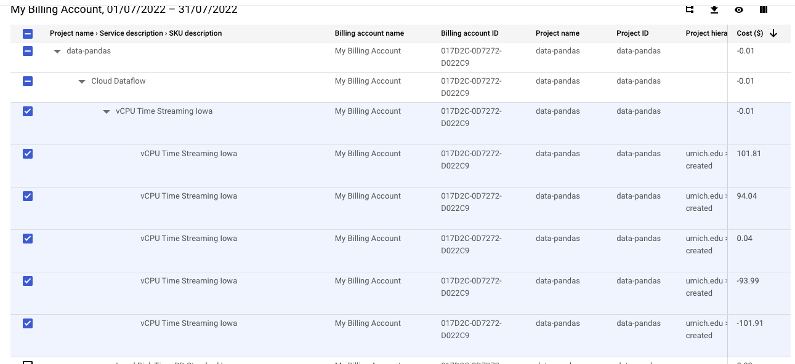

While this does not pose a material blocker to our project, it does provide an invaluable lesson in terms of Data Engineering and Machine Learning Operations. In reality, a pipeline design must factor in more than just functionality -- we must also consider the efficiency, and even the commercial aspects of each of our services. Dataflow is a real-time streaming service, which, for use cases where the prediction results can be batched, may not be the optimal choice. 

# 3. Ethical Consideration
One ethical consideration is the fact that the dataset being used may have sensitive information. The users may not know their Tweet is being scraped and used for analysis, despite being a public Tweet. For example, the typical Twitter user may know that their Tweet is public and anyone can see it but may have no idea it is being used for analysis on the scale that we are on. It is impossible for us (or any researcher) to inform these Twitter users. However, our tool turned out to be very useful. It allows companies to monitor their social media and detect changes in sentiment and topics. This allows them to address any issue (such as a PR crisis) before it is too late. In this sense, although there are privacy concerns, we believe that our tool can be very beneficial in understanding brand image, and the pros outweigh the cons. 

# 4. Discussion
In this project, we built a crawler tool to automatically collect content on Twitter. This is done via the snscrape API. 
Next, we developed a custom labeling tool to tag the content so we have more control over the prediction. This tool is inspired by the MyVoice data challenge, which allows us to label the data in batches instead of row by row.

Then, we did pre-processing, which included lowercasing, removal of stop words, and lemmatization. Once the text is pre-processed, we use tf-idf and bert to vectorize the text, essentially turning the text into numerical values. 
From the vectorized model, we tried different machine learning algorithms to build a classification model with BERT being the best model. We also used unsupervised learning to analyze the content of Tweets. We did this by trying multiple topic modeling algorithms such as LDA and LSI but we found NMF to be the best topic model. The BERT model and NMF will be the model we use for the final steps. 

Once we have the final models, we use GCP to build a dashboard to not only present our analysis results but also build a data processing pipeline as a tool to automate the operation afterward. This includes scheduled Twitter scraping, text preprocessing, and applying our final models to generate predictions. The dashboard shows an overview of the project, the current sentiment results from the classifier, and the top topics from our topic modeling algorithm.

# 5. Conclusion & Next Steps
We used multiple classifications and topic modeling methods to evaluate the best approach to extract sentiments and topics from customer Tweet data. The dashboard is a demonstration of both supervised and unsupervised ML capabilities that is insightful and intuitive for users with or without a technical background. We believe that this tool could help food delivery companies manage their brands on social media channels in a significantly more efficient manner, and has the potential to transform into a full-fledged social monitoring tool that can be scaled to other social media channels, thus outperforming traditional methods such as focus groups or user surveys.

With more time and resources, we would be able to expand our project to other domains and platforms. For example, this project can be scaled to ride-share services, like Uber and Lyft, or e-commerce like amazon and Walmart. Additionally, we would be able to scrape from other platforms other than Twitter, such as Reddit, Yelp, and Google reviews. We see this project as a proof of concept with the ability to scale up to be even more powerful for marketing/public relations teams. 

In addition, if the computational resources are sufficient, we would like to try to use more complex models for classification tasks, such as GPT-3, not-4chan, elmo, etc. as tools for analysis, so that our models can better understand users' Tweeting sentiments. The GCP architecture can be extended into a fully functional Machine Learning Application that can support these models (through Enterprise Tensorflow and support for GPUs/TPUs). It can also be extended to go beyond an end-user dashboard, but integrated into a real-time prediction framework (via Vertex AI’s real-time predictions), or to other NLP tasks. Google Cloud’s NLP AI, for instance, can widen the scope of our project to multi-language tasks, or more advanced NLP tasks such as abstract-based sentiment analysis, syntax analysis, and so on.

# 6. Statement Of Work
Our project workload is evenly divided among team members, with each member focusing on:
- Jason: scripts to scrape and label data, data labeling, sklearn classification models, topic modeling models, Github repo, video editing, and project blog.
- Mel: data labeling, sklearn classification models, GCP pipeline development, Data Studio dashboard, Github repo, project video, and blog.
- Chihshen Hsu: data labeling, fine-tuning BERT model, Github repo, and project blog.

# 7. References
Furtado, C., & Tiu, J. (2021, July 26). Foodpanda Thailand reportedly loses 2 million users. Tech in Asia. https://www.techinasia.com/foodpanda-thailand-reportedly-loses-2m-user-accounts-after-social-media-outburst  
Clark, K., Khandelwal, U., Levy, O., & Manning, C. D. (2019). What does Bert look at? an analysis of bert's attention. arXiv preprint arXiv:1906.04341.  
Sun, C., Qiu, X., Xu, Y., & Huang, X. (2019). How to fine-tune bert for text classification? China national conference on Chinese computational linguistics.
